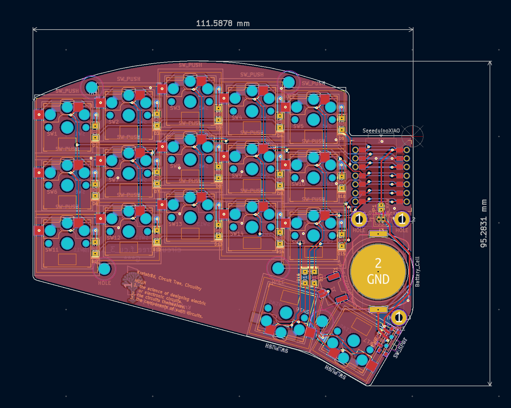
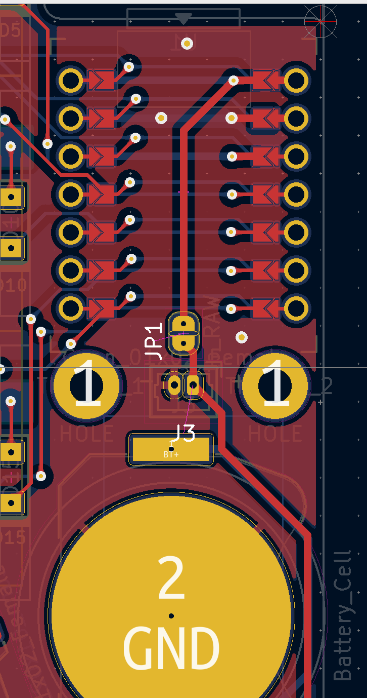

# Kretsträd - a Seeeduino Xiao BLE based 34 keys split keyboard running on ZMK firmware

## Build instruction

This keyboard is able to accommodate two types of batteries. My own prototypes used two LIR2032
rechargeable cell batteries, simply because they seem to be more geeky to my eyes. In such case, all
you have to buy is No.1-10 on BOM list. However, the small 40 mAh capacity requires a charge every
5-7 days on master side and roughly 14 days on peripheral side.

So, if you prefer longivity and less frequent charge, use 501220 lithium ion battery pack rated at
100 mAh. In this case, you should buy everything on BOM except No.9-10. Also, remember to close JP1
jumper on the back side.

Other than that, the build process is quite straight forward:
  - order PCB with readily printable [gerber files](/pcb/gerber). [KiCad files](/pcb) are also in
    place, incase you want to make change;
  - buy components depending on battery type;
  - solder everything into place
  - put in Kailh Choc V1 switches. Yes, this keyboard supports only V1 Choc as for now;
  - Done!

Files for acrylic stacked case are located in [/case](/case) directory. But only cell battery
version is provided. If you chose 501220 battery pack, please remember to make correspondent
modifications.

In case MCU/battery covers are needed, you can draw yourself based on case files and install them
with additional M2x9+3 brass insert spacers placed at TH_PCB_1 ~ TH_PCB_3.

## BOM

| No. | Designator | Package | Quantity |
| :--- | :--- | :--- | :--- |
| 1  | U1 | Seeeduino Xiao BLE (nRF52840) | 2 |
| 2  | D1 ~ D17 | Diode SOD123 THT 1N4148WS 1206 | 34 |
| 3  | SW1 ~ SW17 | Kailh CHOC switch socket PG1350 | 34 |
| 4  | TH1 ~ TH5 | Brass insert M2x5 | 10 |
| 5  | TH1 ~ TH5 | M2x3 flat head screws | 20 |
| 6  | TH_PCB_1 ~ TH_PCB_3 | Plated self-clinching standoff, M2x3 | 6 |
| 7  | TH_PCB_1 ~ TH_PCB_3 | M2x5 flat head screws | 6 |
| 8  | PWR_SW_1,PWR_SW_2 | PCM12SMTR | 2 |
| 9  | J3 | Molex_PicoBlade_53047-0210_1x02_P1.25mm_Vertical,1 | 2 |
| 10 | BT1,BT2 | Battery Holder BK-912 | 2 |
| 11 | J1,J2 | Molex_Panelmate_53780-0270_1x02-1MP_P1.25mm_Horizontal,2 | 2 |

## Firmware

https://github.com/wj-zhe/zmk-config/tree/master/config/boards/shields/kretstrad
